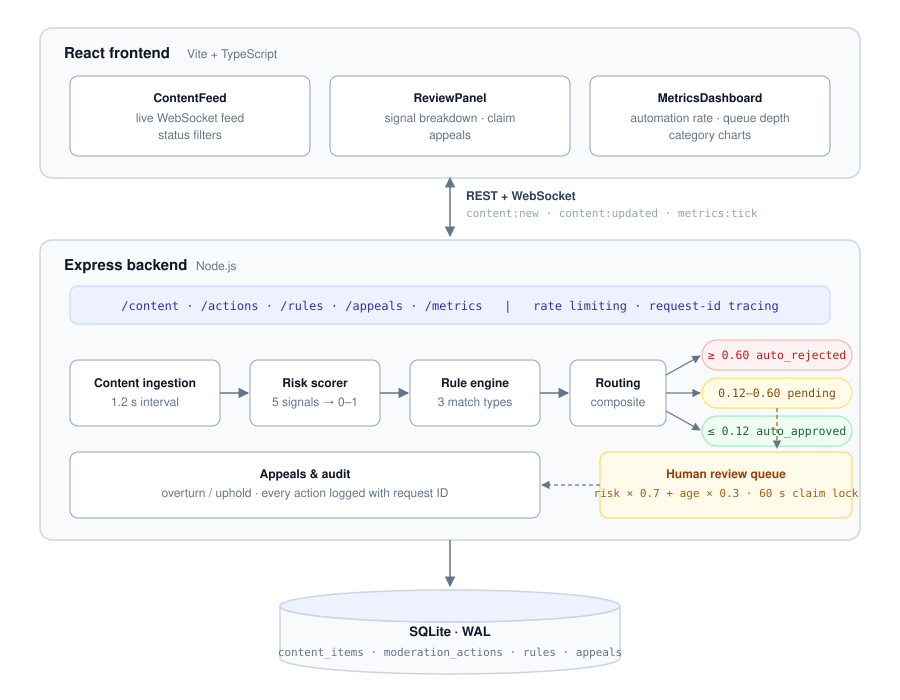

# Arbiter

**A content moderation pipeline built on one principle: automate the confident decisions, spend human attention only where it matters.**

Arbiter simulates enforcement on a live comment stream. Every comment is risk-scored the moment it arrives, matched against moderator-defined rules, and routed one of three ways: clear violations are rejected automatically, clearly benign content passes automatically, and everything ambiguous lands in a prioritised human review queue with locking, appeals, and a full audit trail.

**Stack:** Node.js · Express · SQLite (WAL) · socket.io · React (Vite + TypeScript) · Jest · Docker

## Contents

- [The idea](#the-idea)
- [A comment's journey, with real numbers](#a-comments-journey-with-real-numbers)
- [Architecture](#architecture)
- [Quick start](#quick-start)
- [The moderation lifecycle](#the-moderation-lifecycle)
- [Risk scoring in depth](#risk-scoring-in-depth)
- [API reference](#api-reference)
- [Testing](#testing)
- [Tradeoffs](#tradeoffs)
- [From prototype to production](#from-prototype-to-production)
- [Project structure](#project-structure)

## The idea

A live stream can produce more comments per minute than any human team can read. The naive answers both fail: pure automation makes unacceptable mistakes on ambiguous content, and pure human review cannot keep up with volume.

Arbiter implements the standard industry answer, triage. The scoring system is deliberately confident only at the extremes. A wide middle band of scores routes to humans, and the human queue is engineered so that reviewer time goes to the riskiest and longest-waiting items first, no two moderators waste effort on the same item, and every decision is appealable and auditable.

## A comment's journey, with real numbers

These are actual outputs from the scorer in this repo, not illustrations:

| Comment | Score | Dominant category | Route |
|---|---|---|---|
| `that goal was insane, best stream all week` | 0.00 | NONE | auto approved |
| `FREE MONEY!!!!! click here bit.ly/win now` | 0.57 | SPAM | **pending: human review** |
| `i will hurt you, watch your back` | 0.71 | VIOLENCE | auto rejected |

The middle row is the design working as intended. The comment trips four signals (spam terms, a link, stretch punctuation, caps) yet lands just under the 0.60 auto-reject line, so a human makes the call instead of the machine. Ambiguity routes to people.

For the pending item, the pipeline then takes over: it enters the priority queue at `risk × 0.7 + age × 0.3`, a moderator claims it (a 60 second atomic lock prevents a second moderator reviewing it simultaneously), decides, and the decision, the request ID, and the acting moderator are written to the audit log. If the author appeals, a senior reviewer can overturn the decision, which reverses the content status and writes its own audit entry.

## Architecture



## Quick start

```bash
# Backend
cd backend && npm install && npm run dev    # http://localhost:4000

# Frontend, in a second terminal
cd frontend && npm install && npm run dev   # http://localhost:5173
```

Or with Docker:

```bash
docker compose up --build
```

A content generator starts with the backend and produces simulated live comments every 1.2 seconds, so the feed, queue, and dashboard are populated within moments of starting.

## The moderation lifecycle

**Detection.** Five policy categories (hate speech, violence, spam, adult content, misinformation), each with its own term list and severity weight, combined with four stylistic signals into a 0 to 1 composite score. Every scored item carries a per-signal breakdown and a human-readable explanation, because a review tool that cannot explain its own flags slows reviewers down.

**Rules.** Moderators can add rules at runtime with three match types: TEXT_CONTAINS, REGEX, and RISK_SCORE_GTE. Each rule tracks a fired counter, so ineffective rules are visible and removable.

**Human review.** The pending queue is sorted by `risk × 0.7 + age_weight × 0.3`, surfacing high-risk items first while guaranteeing stale items eventually rise. Claiming an item takes a 60 second optimistic lock via a single conditional SQL update: atomic, deadlock-free, and self-releasing if a reviewer disappears mid-review.

**Appeals and audit.** Any decision can be appealed. Senior review either upholds or overturns; an overturn reverses the content decision. Every action, automated or human, is written to a moderation actions table with the acting moderator and the originating request ID.

**Operations.** Per-route rate limiting (30/min on actions, 10/min on appeals), UUID request tracing on every request, and a `/api/metrics` endpoint reporting queue depth, average queue age, decision breakdown, hourly throughput, per-rule fired counts, category distribution, and uptime. All state changes push to clients over socket.io (`content:new`, `content:updated`, `metrics:tick`); nothing polls.

## Risk scoring in depth

Category term matching drives the score. Stylistic signals only nudge borderline cases.

**Step 1: category signal.** Text is scanned against every category's term list, and hits convert to a 0 to 1 signal via the category's severity weight:

```
category_signal = min((hits × category_weight) / 2, 1)

Severity weights:
  HATE_SPEECH     0.90
  VIOLENCE        0.85
  ADULT_CONTENT   0.80
  MISINFORMATION  0.65
  SPAM            0.60
```

Two hits on a 0.90-severity category already produce a 0.90 signal, enough to auto-reject on its own. The highest-scoring category becomes the item's dominant category.

**Step 2: composite.** The dominant category signal blends with four stylistic signals. Keyword evidence deliberately dominates; caps, links, and spam patterns exist to push ambiguous content toward human review, not to condemn it outright:

```
composite_score =
  keyword_density      × 0.84
  + all_caps_ratio     × 0.06
  + link_presence      × 0.06
  + repeat_character   × 0.02
  + excess_punctuation × 0.02
```

**Step 3: routing.**

```
score >= 0.60 → auto_rejected
score <= 0.12 → auto_approved
otherwise     → pending (human review queue)
```

The thresholds are asymmetric on purpose. The wide pending band (0.12 to 0.60) means the system only acts autonomously when it is confident, and the low auto-approve bar means only clearly benign content skips review entirely.

Everything above is configuration, not architecture: category terms, severity weights, and thresholds live in `backend/src/scoring/categories.js`, composite weights in `riskScorer.js`.

## API reference

| Method | Endpoint | Description |
|---|---|---|
| GET | `/api/content` | List content, optional `?status=` filter |
| GET | `/api/content/queue` | Priority-sorted pending queue |
| GET | `/api/content/:id` | Single item with signals and audit trail |
| POST | `/api/actions` | `{contentId, action, moderatorId}` |
| POST | `/api/actions/claim/:id` | `{moderatorId}`, takes an exclusive 60 second lock |
| GET | `/api/rules` | List rules with fired counts |
| POST | `/api/rules` | `{name, matchType, pattern, category, action, weight}` |
| DELETE | `/api/rules/:id` | Delete a rule |
| GET | `/api/appeals` | List appeals, optional `?status=` filter |
| GET | `/api/appeals/:id` | Single appeal |
| POST | `/api/appeals` | `{contentId, requester, reason}` |
| POST | `/api/appeals/:id/decision` | `{action: "overturn" or "uphold", reviewedBy}` |
| GET | `/api/metrics` | System health snapshot |
| GET | `/api/health` | `{status, queueDepth}` |

## Testing

```bash
cd backend
npm test   # 35 tests across 3 suites
```

Unit suites cover the risk scorer and rule engine. An integration suite exercises the appeals workflow end to end, including decision reversal on overturn.

## Tradeoffs

| Decision | Chose | Over | Because |
|---|---|---|---|
| Storage | SQLite (WAL) | PostgreSQL | Zero external dependencies for a portfolio project; the store interface swaps to a pg pool with minimal changes |
| Live updates | socket.io | SSE / polling | Bidirectional channel (future moderator presence) and automatic reconnection with no extra client library |
| Review locking | Optimistic, 60 s TTL | Pessimistic locks | A closed tab mid-review self-heals when the TTL expires; no deadlocks, no manual lock release |
| Rule engine | In-process, synchronous | Async worker fleet | Right-sized for a single-node prototype; the production path is documented below |

## From prototype to production

Each component maps to a production counterpart:

| In this repo | At platform scale |
|---|---|
| SQLite (WAL) | PostgreSQL with read replicas |
| In-process comment generator | Kafka consumer on the real comment stream |
| Synchronous rule engine | Async worker fleet (BullMQ or Celery) consuming from a topic |
| Term-list scoring | Served ML model contributing confidence scores alongside rules |
| Single node | Multi-region deployment with region-affinity routing |
| Anonymous moderators | Authentication with role-based access (tier-1, tier-2, admin) |
| `/api/metrics` JSON | Prometheus endpoint with a Grafana dashboard |

## Project structure

```
backend/
  src/
    scoring/      signals, categories, composite scorer
    queue/        priority queue with lock-aware fetch
    data/         SQLite stores (content, rules, appeals)
    routes/       content, actions, rules, appeals, metrics
    middleware/   rate limiting, request-id tracing
    websocket/    socket.io event hub
    utils/        simulated comment generator
frontend/
  src/
    components/   ContentFeed, ReviewPanel, MetricsDashboard, RuleBuilder
    hooks/        WebSocket and data hooks
tests/
  unit/           riskScorer, rulesEngine
  integration/    appeals workflow
```